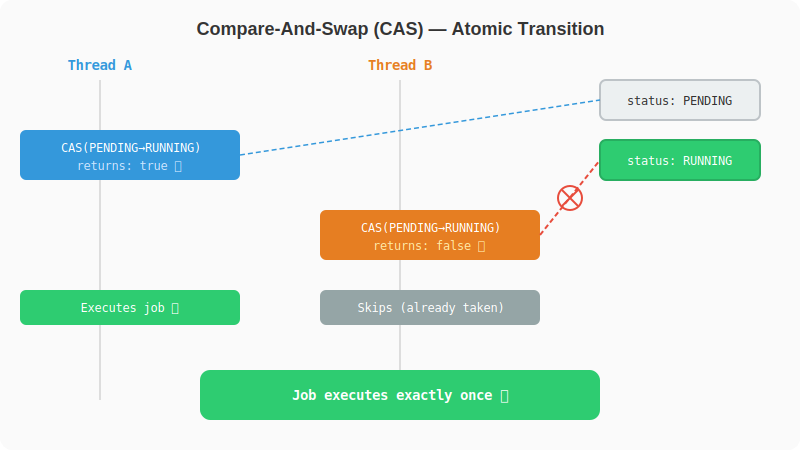

# Chapter 2: A Customer Gets Charged Twice

[← Chapter 1: Your First Day](part-01-project-setup.md) | [Chapter 3: The Dashboard Lies →](part-03-visibility.md)

---

## The Scaling Problem

The engine from Chapter 1 works. Three green tests. Linus is happy. You deploy to staging.

Then real traffic hits. The engine processes jobs one at a time, sequentially:

```java
engine.submit(slowPayment);   // blocks for 5 seconds
engine.submit(urgentRefund);  // waits... can't start until slowPayment finishes
engine.submit(sendEmail);     // still waiting...
```

If `slowPayment` takes 5 seconds, `urgentRefund` sits there doing nothing. With 100 jobs queued up, the last one waits for all 99 to finish. Your throughput is one job at a time.

You write a test that sets the bar: 4 jobs × 500ms should finish under 1.5 seconds. With the current engine, it fails.

```java
// src/test/java/com/jobengine/engine/JobEngineThroughputTest.java
package com.jobengine.engine;

import com.jobengine.model.Job;
import org.junit.jupiter.api.Test;

import static org.assertj.core.api.Assertions.assertThat;

class JobEngineThroughputTest {

    @Test
    void shouldProcessFourJobsUnder1500ms() {
        JobEngine engine = new JobEngine();
        int jobCount = 4;

        long start = System.currentTimeMillis();

        for (int i = 0; i < jobCount; i++) {
            Job job = new Job("job-" + i, "slow-" + i, () -> {
                try { Thread.sleep(500); }
                catch (InterruptedException e) { Thread.currentThread().interrupt(); }
            });
            engine.submit(job);
        }

        long elapsed = System.currentTimeMillis() - start;

        // FAILS — sequential execution: 4 × 500ms ≈ 2000ms
        assertThat(elapsed).isLessThan(1500);
    }
}
```

```bash
./gradlew test --tests "com.jobengine.engine.JobEngineThroughputTest"
```

```
expected: less than 1500
 but was: 2031
```

Four jobs, 500ms each, total wall time: ~2 seconds. The engine can't start the second job until the first one finishes. That's the bottleneck.

> **@linus:** The queue is backing up. We're processing 1 job every 3 seconds. We need parallelism.

The fix is obvious: use threads. Run jobs concurrently so a slow job doesn't block everything else.

## Adding Threads

You refactor the engine. Instead of executing jobs inline, you add a thread pool and a `submit()` method that hands jobs to worker threads.

```java
// src/main/java/com/jobengine/engine/JobEngine.java
package com.jobengine.engine;

import com.jobengine.model.Job;
import com.jobengine.model.JobStatus;

import java.time.Instant;
import java.util.concurrent.ExecutorService;
import java.util.concurrent.Executors;

public class JobEngine {

    private final ExecutorService workers;

    public JobEngine(int workerCount) {
        this.workers = Executors.newFixedThreadPool(workerCount);
    }

    /** Use default: availableProcessors × 2 (good for I/O-bound jobs). */
    public JobEngine() {
        this(Runtime.getRuntime().availableProcessors() * 2);
    }

    /** Original single-threaded logic — now private, called by workers. */
    private void process(Job job) {
        if (!job.transitionTo(JobStatus.PENDING, JobStatus.RUNNING)) {
            return;
        }

        job.setStartedAt(Instant.now());

        try {
            job.getTask().run();
            job.transitionTo(JobStatus.RUNNING, JobStatus.COMPLETED);
        } catch (Exception e) {
            job.transitionTo(JobStatus.RUNNING, JobStatus.FAILED);
            job.setFailureReason(e.getMessage());
        }

        job.setCompletedAt(Instant.now());
    }

    /** Submit a job to the thread pool for async processing. */
    public void submit(Job job) {
        workers.submit(() -> process(job));
    }

    /** Stop accepting new jobs. Already-submitted jobs will finish. */
    public void shutdown() {
        workers.shutdown();
    }

    /**
     * Block until all submitted jobs complete, or the timeout expires.
     * Call this after shutdown() to wait for in-flight work to drain.
     * Returns true if all jobs finished, false if the timeout was reached.
     */
    public boolean awaitTermination(long timeout, java.util.concurrent.TimeUnit unit)
            throws InterruptedException {
        return workers.awaitTermination(timeout, unit);
    }
}
```

### How Many Workers?

The right number depends on what your jobs do:

| Job type | Rule of thumb | Why |
|----------|--------------|-----|
| CPU-bound (math, parsing, compression) | `Runtime.getRuntime().availableProcessors()` | More threads than cores just adds context-switching overhead |
| I/O-bound (HTTP calls, DB queries, file reads) | `cores × 2` or higher | Threads spend most of their time waiting, so you can oversubscribe |
| Mixed | Start with `cores × 2`, measure, adjust | Profile before guessing |

```java
// Explicit
JobEngine engine = new JobEngine(16);

// Or use the default (cores × 2)
JobEngine engine = new JobEngine();
```

Our jobs are mostly I/O (payment APIs, email services), so `cores × 2` is a reasonable default. We pass an explicit count in tests to keep things predictable.

Now update the test to use the threaded engine:

```java
// src/test/java/com/jobengine/engine/JobEngineThroughputTest.java
package com.jobengine.engine;

import com.jobengine.model.Job;
import org.junit.jupiter.api.Test;

import java.util.concurrent.CountDownLatch;
import java.util.concurrent.TimeUnit;

import static org.assertj.core.api.Assertions.assertThat;

class JobEngineThroughputTest {

    @Test
    void shouldProcessFourJobsUnder1500ms() throws InterruptedException {
        JobEngine engine = new JobEngine(4); // 4 worker threads
        int jobCount = 4;
        CountDownLatch allDone = new CountDownLatch(jobCount);

        long start = System.currentTimeMillis();

        for (int i = 0; i < jobCount; i++) {
            Job job = new Job("job-" + i, "slow-" + i, () -> {
                try { Thread.sleep(500); }
                catch (InterruptedException e) { Thread.currentThread().interrupt(); }
                allDone.countDown();
            });
            engine.submit(job);
        }

        allDone.await(5, TimeUnit.SECONDS);
        long elapsed = System.currentTimeMillis() - start;

        engine.shutdown();

        // ✅ PASSES — parallel: 4 workers × 500ms ≈ 500ms
        assertThat(elapsed).isLessThan(1500);
    }
}
```

```bash
./gradlew test --tests "com.jobengine.engine.JobEngineThroughputTest"
```

Same test, same assertion. Before: 2000ms, fails. After: ~500ms, passes. The thread pool is the difference.

Throughput jumps. The queue drains faster. Linus nods. You deploy to production.

For three days, everything is fine.

## The Incident

Thursday, 3 PM. Slack lights up.

> **@linus:** We have a customer who got charged twice for the same order. Payment job ran two times. Can you look at the engine?

Linus never uses exclamation marks in Slack. When he does, someone's getting fired. This message has none, but you can feel the tension.

Your stomach drops. You check the logs.


Two worker threads picked up the same payment job at the same time. Both saw `status = PENDING`. Both transitioned to `RUNNING`. Both charged the customer.

Your single-threaded smoke tests never caught this. Time to figure out why.

## The Bug — Check-Then-Act

Look at `transitionTo()` from Chapter 1:

```java
public boolean transitionTo(JobStatus expected, JobStatus next) {
    if (this.status == expected) {   // Thread A reads PENDING
        // ← Thread B also reads PENDING here (context switch)
        this.status = next;           // Thread A writes RUNNING
        return true;                  // Thread B also writes RUNNING
    }
    return false;
}
```

This is the classic **check-then-act** race condition. The `if` check and the `status = next` write are two separate operations. Between them, another thread can read the same value and also enter the block. Both threads see `PENDING`, both write `RUNNING`, both run the task.

With one thread, this never happens — there's nobody to interleave with. The moment you add a second thread, the gap between the `if` and the assignment becomes a window for disaster.

## Reproducing the Bug

Let's write a test that proves it. Two worker threads pick up the same job via `submit()`. We expect the task to run exactly once.

```java
// src/test/java/com/jobengine/engine/JobEngineRaceTest.java
package com.jobengine.engine;

import com.jobengine.model.Job;
import org.junit.jupiter.api.AfterEach;
import org.junit.jupiter.api.RepeatedTest;

import java.util.concurrent.TimeUnit;
import java.util.concurrent.atomic.AtomicInteger;

import static org.assertj.core.api.Assertions.assertThat;

class JobEngineRaceTest {

    private JobEngine engine;

    @AfterEach
    void tearDown() throws InterruptedException {
        if (engine != null) {
            engine.shutdown();
        }
    }

    /**
     * Submit the same job twice. Two worker threads race to execute it.
     * We expect the task to run exactly once.
     *
     * @RepeatedTest because race conditions are timing-dependent.
     */
    @RepeatedTest(50)
    void jobShouldExecuteExactlyOnce() throws InterruptedException {
        engine = new JobEngine(2);
        AtomicInteger runCount = new AtomicInteger(0);

        Job job = new Job("1", "payment", () -> runCount.incrementAndGet());

        // Both workers race to execute the same job
        engine.submit(job);
        engine.submit(job);

        engine.shutdown();
        engine.awaitTermination(5, TimeUnit.SECONDS);

        assertThat(runCount.get()).isEqualTo(1); // FAILS — sometimes 2
    }
}
```

Run it:

```bash
./gradlew test --tests "com.jobengine.engine.JobEngineRaceTest"
```

It fails intermittently. Some runs pass, some don't:

```
expected: 1
 but was: 2
```

The job ran twice. In a payment system, that's a double charge.

## The Fix — AtomicReference with CAS

The fix is to make the check-and-write happen as a single, indivisible operation. Java's `AtomicReference` provides exactly this with Compare-And-Swap (CAS).

The `Job` class keeps the same 3 fields from Chapter 1. The only change is how `status` is stored and how `transitionTo()` works.

```java
// src/main/java/com/jobengine/model/Job.java
package com.jobengine.model;

import java.time.Instant;
import java.util.concurrent.atomic.AtomicReference;

public class Job {

    private final String id;
    private final String name;
    private final Runnable task;

    // ✅ FIX: AtomicReference instead of plain field
    private final AtomicReference<JobStatus> status = new AtomicReference<>(JobStatus.PENDING);
    private volatile Instant startedAt;
    private volatile Instant completedAt;
    private volatile String failureReason;

    public Job(String id, String name, Runnable task) {
        this.id = id;
        this.name = name;
        this.task = task;
    }

    // ✅ FIX: CAS fuses check + write into one atomic CPU instruction
    public boolean transitionTo(JobStatus expected, JobStatus next) {
        return status.compareAndSet(expected, next);
    }

    // Getters
    public String getId() { return id; }
    public String getName() { return name; }
    public Runnable getTask() { return task; }
    public JobStatus getStatus() { return status.get(); }
    public Instant getStartedAt() { return startedAt; }
    public Instant getCompletedAt() { return completedAt; }
    public String getFailureReason() { return failureReason; }

    public void setStartedAt(Instant t) { this.startedAt = t; }
    public void setCompletedAt(Instant t) { this.completedAt = t; }
    public void setFailureReason(String r) { this.failureReason = r; }
}
```

Two changes:
1. `private JobStatus status` → `private final AtomicReference<JobStatus> status`
2. `if (status == expected) { status = next; }` → `status.compareAndSet(expected, next)`

That's it. Same constructor. Same getters. The `volatile` on the timestamp fields is a bonus — we'll explain why in Chapter 3.

## How CAS Works



`compareAndSet(expected, next)` does this in a single CPU instruction:

1. Read the current value
2. Compare it to `expected`
3. If they match, write `next`
4. If they don't match, do nothing and return `false`

Steps 1-3 are **indivisible**. No thread can slip in between. If 100 threads race to transition PENDING → RUNNING, exactly one wins. The other 99 get `false`.

```
Thread A: compareAndSet(PENDING, RUNNING) → true  ✅ (wins the race)
Thread B: compareAndSet(PENDING, RUNNING) → false ❌ (PENDING is gone, sees RUNNING)
```

## The Test That Proves the Fix

```java
// src/test/java/com/jobengine/model/JobTest.java
package com.jobengine.model;

import org.junit.jupiter.api.Test;

import static org.assertj.core.api.Assertions.assertThat;

class JobTest {

    @Test
    void shouldStartAsPending() {
        Job job = new Job("1", "test", () -> {});
        assertThat(job.getStatus()).isEqualTo(JobStatus.PENDING);
    }

    @Test
    void shouldTransitionWithCAS() {
        Job job = new Job("1", "test", () -> {});

        assertThat(job.transitionTo(JobStatus.PENDING, JobStatus.RUNNING)).isTrue();
        assertThat(job.getStatus()).isEqualTo(JobStatus.RUNNING);

        // Can't transition from PENDING again — already RUNNING
        assertThat(job.transitionTo(JobStatus.PENDING, JobStatus.RUNNING)).isFalse();
    }

    @Test
    void shouldCompleteFullLifecycle() {
        Job job = new Job("1", "test", () -> {});

        assertThat(job.transitionTo(JobStatus.PENDING, JobStatus.RUNNING)).isTrue();
        assertThat(job.transitionTo(JobStatus.RUNNING, JobStatus.COMPLETED)).isTrue();

        // Can't go back
        assertThat(job.transitionTo(JobStatus.COMPLETED, JobStatus.RUNNING)).isFalse();
    }
}
```

```bash
./gradlew test --tests "com.jobengine.model.JobTest"
```

## Why Not `synchronized`?

You could do this:

```java
public synchronized boolean transitionTo(JobStatus expected, JobStatus next) { ... }
```

It works, but:
- `synchronized` acquires a lock — if the thread holding it gets paused, everyone waits
- CAS is **lock-free** — no thread can block another
- Under high contention (100+ threads), CAS scales better because there's no lock convoy

Use `synchronized` when you need to protect multiple operations together. Use CAS when you need a single atomic state change.

## What We Changed

Two things, both in `Job.java`:

| Before (Chapter 1) | After (Chapter 2) |
|---|---|
| `private JobStatus status` | `private final AtomicReference<JobStatus> status` |
| `if (status == expected) { status = next; }` | `status.compareAndSet(expected, next)` |

We also added `volatile` on the mutable timestamp fields (`startedAt`, `completedAt`, `failureReason`). We'll explain why those matter in Chapter 3.

You write the postmortem: "Double-execution caused by non-atomic status transition. Fixed with AtomicReference + CAS." Linus approves the fix. You deploy.

The double-charge bug is gone. But the next morning, the monitoring dashboard shows something weird...

---

[← Chapter 1: Your First Day](part-01-project-setup.md) | [Chapter 3: The Dashboard Lies →](part-03-visibility.md)
